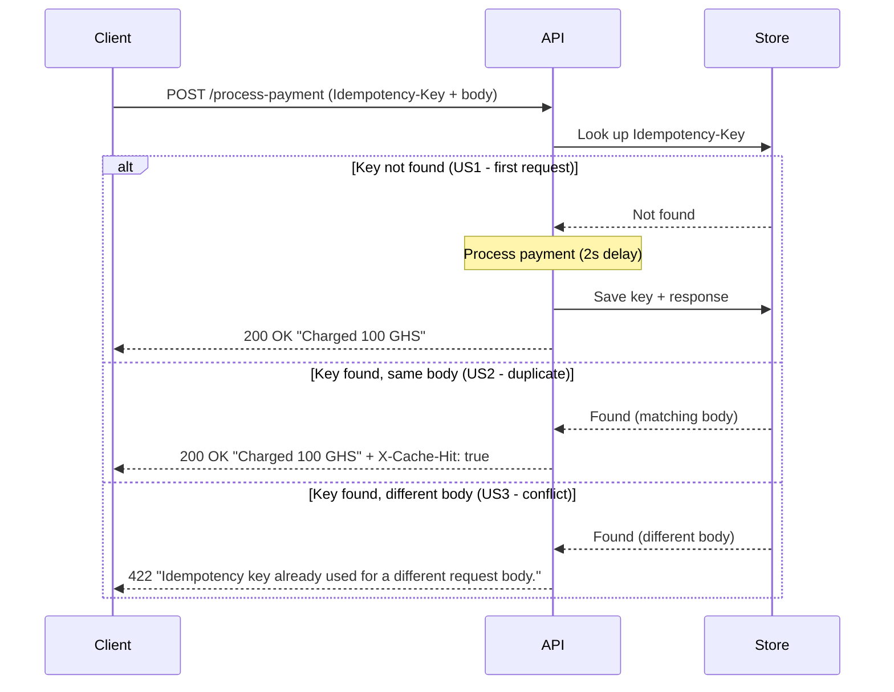

# Idempotency-Gateway (The "Pay-Once" Protocol)

A RESTful idempotency layer that ensures each unique payment request is processed exactly once, even under client retries.

## 1. Architecture Diagram


## 2. Setup Instructions

### Prerequisites
- Python 3.10+
- `pip` and `venv`

### Installation

```bash
# Clone the repository
git clone https://github.com/C-Ronny/Idempotency-Gateway.git
cd Idempotency-Gateway

# Create and activate a virtual environment
python3 -m venv venv
source venv/bin/activate        # On Windows: venv\Scripts\activate

# Install dependencies
pip install -r requirements.txt
```

### Running the server

```bash
uvicorn main:app --reload
```

The server starts at `http://127.0.0.1:8000`. Interactive API documentation is auto-generated and available at `http://127.0.0.1:8000/docs`.


## 3. API Documentation

#### `GET /`
Health-check endpoint. Returns `{"status": "ok"}` to confirm the server is running.

#### `POST /process-payment`
Processes a payment exactly once per unique idempotency key.

**Headers**

| Header | Required | Description |
|---|---|---|
| `Idempotency-Key` | Yes | A unique string identifying this payment attempt. Retries must reuse the same key. |
| `Content-Type` | Yes | `application/json` |

**Request body**

```json
{
  "amount": 100,
  "currency": "GHS"
}
```

**Responses**

| Scenario | Status | Body | Notes |
|---|---|---|---|
| First request (new key) | `200 OK` | `{"message": "Charged 100 GHS"}` | Payment processed; ~2s simulated delay |
| Duplicate (same key, same body) | `200 OK` | `{"message": "Charged 100 GHS"}` | Replayed from cache; header `X-Cache-Hit: true`; no reprocessing |
| Conflict (same key, different body) | `422` | `{"detail": "Idempotency key already used for a different request body."}` | Rejected to protect data integrity |

**Example requests**

US1: First request (processes payment):

```bash
curl -i -X POST http://127.0.0.1:8000/process-payment \
  -H "Idempotency-Key: order-123" \
  -H "Content-Type: application/json" \
  -d '{"amount": 100, "currency": "GHS"}'
```

US2: Duplicate retry (returns cached response with `X-Cache-Hit: true`):

```bash
curl -i -X POST http://127.0.0.1:8000/process-payment \
  -H "Idempotency-Key: order-123" \
  -H "Content-Type: application/json" \
  -d '{"amount": 100, "currency": "GHS"}'
```

US3: Conflict (same key, changed amount → `422`):

```bash
curl -i -X POST http://127.0.0.1:8000/process-payment \
  -H "Idempotency-Key: order-123" \
  -H "Content-Type: application/json" \
  -d '{"amount": 500, "currency": "GHS"}'
```

## 4. Design Decisions

**Python + FastAPI.** Chosen over Node/Express or Flask because FastAPI is async-native — which made the bonus race-condition handling easier with `asyncio`. It also gives free request validation (Pydantic) and auto-generated docs at `/docs`.

**Dictionary storage.** Used instead of a file-based store because a plain file has no concurrency control — two simultaneous requests could both read "key absent" and double-charge, reintroducing the bug the system prevents. Production could use Redis.

**Single flat `main.py`.** A multi-folder package structure for one endpoint would be premature abstraction. Concerns (routing, idempotency logic, storage) are separated logically within the file so it could be split later if needed.

**`float` amounts with conditional formatting.** Used `float` to support real-world decimals, with a conditional that renders whole numbers as `100` (not `100.0`) to match the required exact response string. Can also use `Decimal` to avoid float rounding errors on money.

**Per-key `asyncio.Lock`, not a global lock.** The 2-second window between a request's check and its save lets a second identical request pass through and double-charge. A per-key lock serializes same-key requests while letting unrelated keys run in simultaneously. 

## 5. Developer's Choice -  Configurable Key Expiration (TTL)

I added a time-to-live (TTL) on stored idempotency keys to prevent the store from growing forever and getting full on the many requests and because a key reused long after the original request represents a new payment, not a retry.

The TTL is kept as a named constant `IDEMPOTENCY_TTL_SECONDS` to demonstrate expiry during testing. 