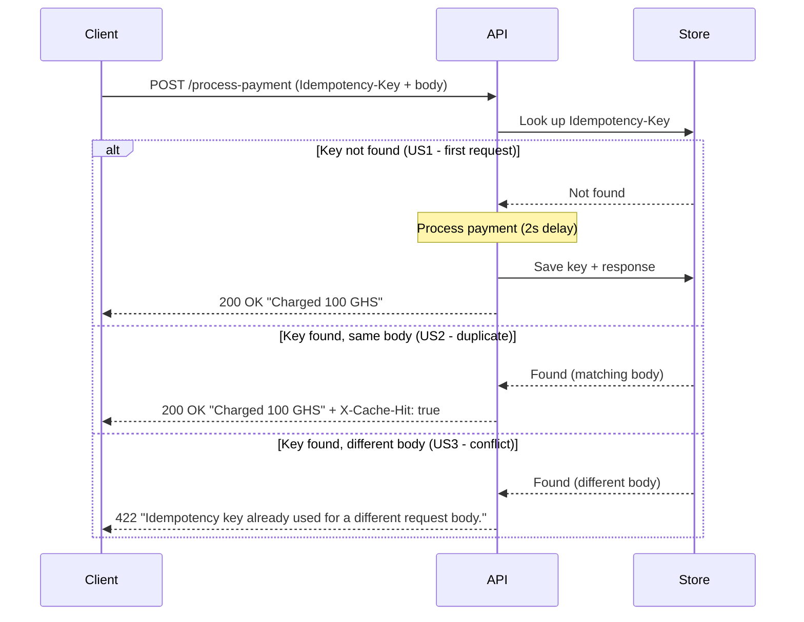

````markdown
# Idempotency-Gateway (The "Pay-Once" Protocol)

A RESTful idempotency layer that ensures each unique payment request is processed exactly once, even under client retries.

## Architecture Diagram


````